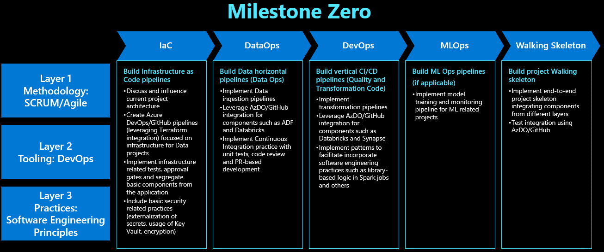

# Dataops

## Overview

One of the offerings of the DevSquad is help customers implement DataOps practices and technologies, through an engagement we call Milestone Zero.

Usually customers are comfortable deploying Data technologies and assets in the Azure portal, but they have found a hard time when trying to do it through GitHub Actions or Azure DevOps.

Most of the help needed has been around these different workloads:

* Infrastructure as Code
* Databricks
* Azure Data Factory
* Azure Synapse
